---

# Ultimate RPS - README

## Project Overview

Welcome to Ultimate RPS! This project is a comprehensive demonstration of my skills as a Full Stack Developer, showcasing my proficiency in front-end and back-end web technologies. Developed as part of my Full Stack Developer course at Code Institute, this game utilizes HTML, CSS, and JavaScript to offer an engaging and interactive experience.

Ultimate RPS allows players to challenge the computer in an expanded version of the classic Rock Paper Scissors game, incorporating additional moves like Lizard and Spock. The objective is to reach a score of 10 before the computer does, making it an exciting and competitive experience. This README provides a detailed overview of the project's features, the technologies used, and the criteria met, highlighting the various elements that contribute to the game's functionality and user experience.
Welcome to <a href="https://sharanraj16.github.io/ultimateRPS2/" target="_blank" rel="noopener">UltimateRPS</a>

## How I Came Up with the Rock Paper Scissors Game
For my second project in the Code Institute Full Stack Developer course, I wanted to build something that was not only fun but also challenged me to think about game logic and user interaction. After brainstorming, I thought back to childhood games that were simple yet engaging, and that's when I remembered the classic Rock, Paper, Scissors game.

This game stood out to me because of its simplicity, but also because it involves strategy, randomness, and interaction—all perfect elements for practicing JavaScript and front-end development. I knew that implementing the game would allow me to solidify my understanding of conditionals, functions, and DOM manipulation, while also creating a project that users could instantly connect with and enjoy.

To focus on the core gameplay experience and ensure a clean, polished look, I decided to remove the theme option from this version of the game. However, I plan to reintroduce and expand upon the theme options in my upcoming projects, making them more dynamic and customizable.

So, I decided to go with it! It felt like the perfect balance between challenging myself and building something familiar, and I’m excited to bring this classic game to life through code.

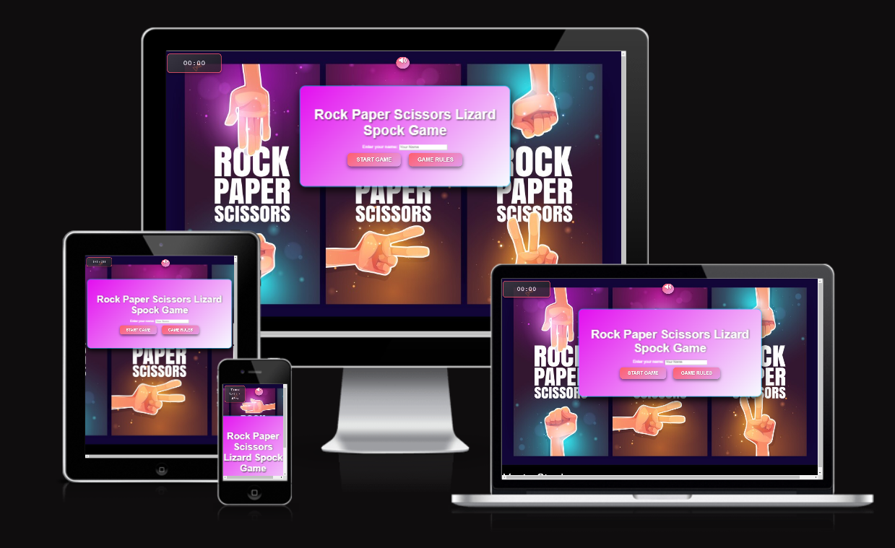
## Features

### 1. **User Interface**

The user interface of the game is crafted to be user-friendly and visually appealing, ensuring an enjoyable experience for players. The design elements include:
## Wireframes

The wireframes for the UltimateRPS project were produced in Balsamiq.  There are frames for a desktop device and for a mobile device.  

## Desktop Device Wireframes 

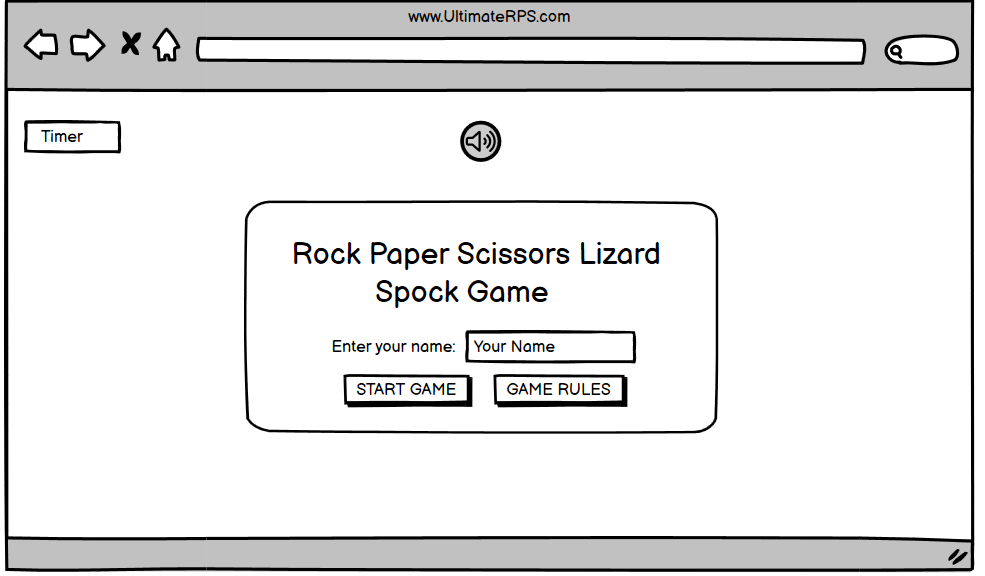
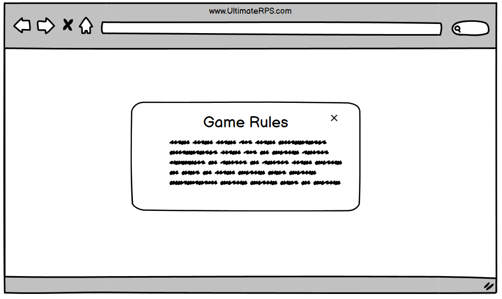
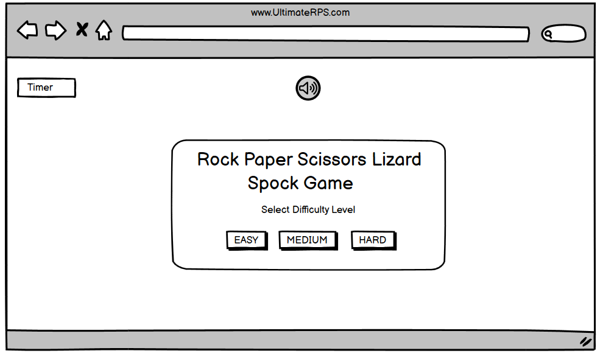
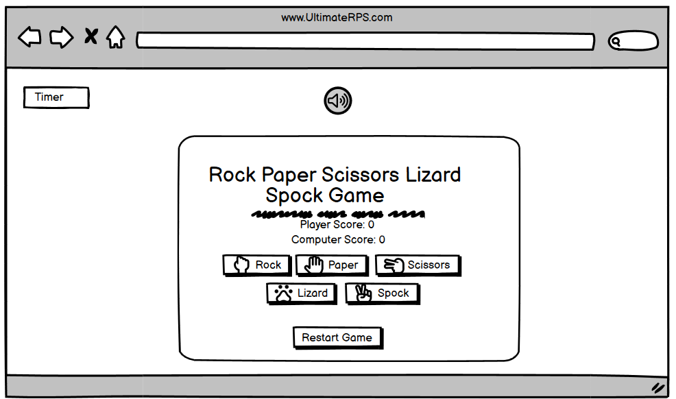

## Mobile Device Wireframes

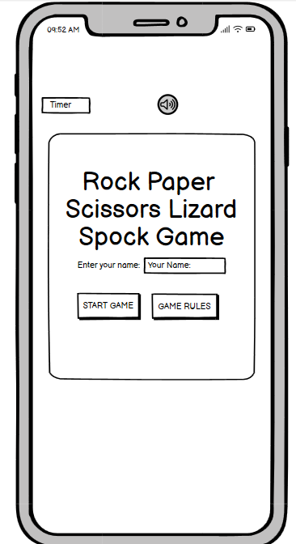
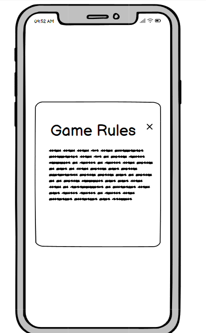
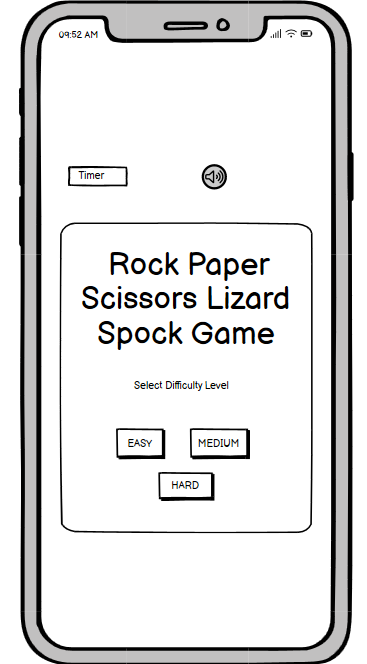
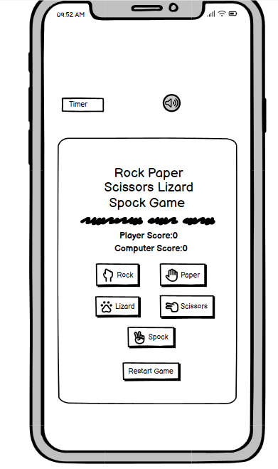
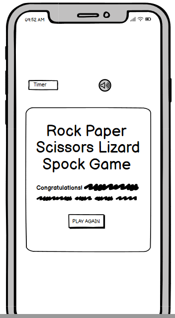

## color sceme ##
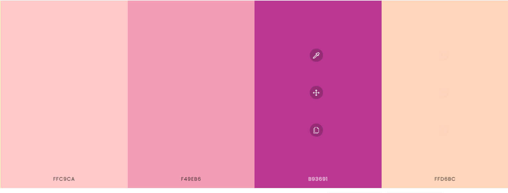

- **Name Input Section**: Users enter their name to personalize the game experience. This section includes a label and buttons to start the game or view the rules.
- **Game Section**: Visible after starting the game, it includes:
  - **Score Board**: Displays the current scores for both the player and the computer.
  - **Move Selection Buttons**: Buttons for Rock, Paper, Scissors, Lizard, and Spock, styled with icons.
  - **Result Display**: Shows the outcome of each round and feedback on the choices made.
  - **Timer**: Limits the duration of each round to keep the game fast-paced.
  - **Restart Button**: Allows restarting the game at any time.
- **Game Over Section**: Appears when the game ends, displaying the result and offering an option to play again.
- **Rules Modal**: Displays game rules when the "Game Rules" button is clicked.
- **Mute Button**: Toggles background music and sound effects on and off.

### 2. **Game Logic**

Implemented in JavaScript, the game logic includes:

- **Round Decision**: Determines the winner of each round based on Rock, Paper, Scissors, Lizard, Spock rules.
- **Score Tracking**: Updates scores in real-time, continuing until one side reaches a score of 10.
- **Timer**: A countdown timer for each round, adding urgency and excitement.
- **Game End Handling**: Displays messages indicating the game’s outcome when it ends.
- **Restart Functionality**: Resets scores and reinitializes the game state.

### 3. **Audio Feedback and Background Music**

Sound effects and background music enhance the gaming experience:

- **Click Sound**: Played when interacting with buttons.
- **Win Sound**: Played when the player wins a round.
- **Lose Sound**: Played when the player loses a round.
- **Background Music**: Continuous music that can be muted using the mute button.

### 4. **GitHub Deployment and Clone**

Explain how to do deployment and clone in github

### 5. **End Credits**

Acknowledges the contributions of code intitute Tutor Assistance,student care,slack community,error makes clever  and Logic First Tamil YouTube channels, which provided valuable resources and guidance throughout development.

## Technologies Used

### 1. **HTML**

HTML forms the structural backbone of the game, including:

- **`
` Tags**: For sections like name input, gameplay, scores, results, and modals.
- **`<button>` Tags**: For interactive elements like game controls, theme selection, mute button, and action buttons.
- **`
` Tags**: For text such as scores, result messages, and timer.
- **`<input>` Tag**: For the player’s name input field.
- **`<audio>` Tags**: For sound effects and background music.

### 2. **CSS**

CSS styles the game interface for a visually appealing design, including:

- **Body Styling**: Applies a gradient background and centers content. 
- **Game Card Styling**: Features a  gradient background with rounded corners and a shadow effect.
- **Button Styling**: Includes vibrant gradients, rounded corners, animations, hover effects, and active states.
- **Modal Styling**: Ensures the modal is prominently displayed with a semi-transparent background and centered content.
- 

### 3. **JavaScript**

JavaScript adds interactivity and logic to the game, including:

- **Game Initialization**: Manages the player's name input and transitions to the game section.
- **Round Processing**: Handles player moves, generates the computer’s move, determines results, updates scores, and plays sound effects.
- **Timer**: Manages the countdown for each round and updates the display.
- **Game End and Restart**: Manages end-of-game scenarios and resets scores for a new game.
- **Modal Management**: Controls the display of the rules modal and handles clicks outside the modal to close it.
- **Mute Button**: Toggles sound effects and background music.

### JavaScript Techniques Used

- **Event Handling**: Utilized extensively to manage user interactions. For example, clicking buttons triggers specific functions that handle game actions and state changes.
- **DOM Manipulation**: Key for updating the game interface dynamically. JavaScript is used to update the score, display results, and switch between game states by modifying the DOM elements.
- **Random Number Generation**: Used to simulate the computer’s move in each round. This ensures that the game remains unpredictable and fair.
- **Conditional Statements**: Crucial for determining the outcome of each round. The logic checks the player's move against the computer's move to decide the winner.
- **Functions**: Modular approach to handle various game functionalities, such as starting the game, playing a round, ending the game, and showing/hiding the rules modal.
- **Audio API**: Plays sound effects and background music based on game events, enhancing user experience through audio feedback.
- **Timer**: Uses JavaScript's timing events to create a countdown for each round.
- **Local Storage**: Could be used to store the player’s name, theme selection, or game state to persist data across sessions (though not implemented in the current version).

## Detailed JavaScript Logic

### 1. **Initialization**

The `startGame()` function:
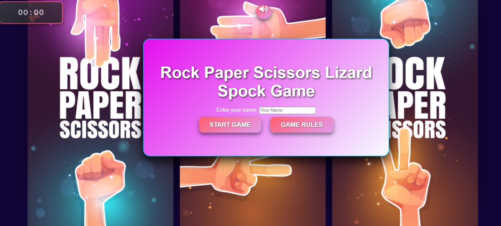
- Retrieves and validates the player’s name.
- Displays a welcome message and transitions to the game section.

### 2. **Handling Player Moves**

The `playGame(playerChoice)` function:
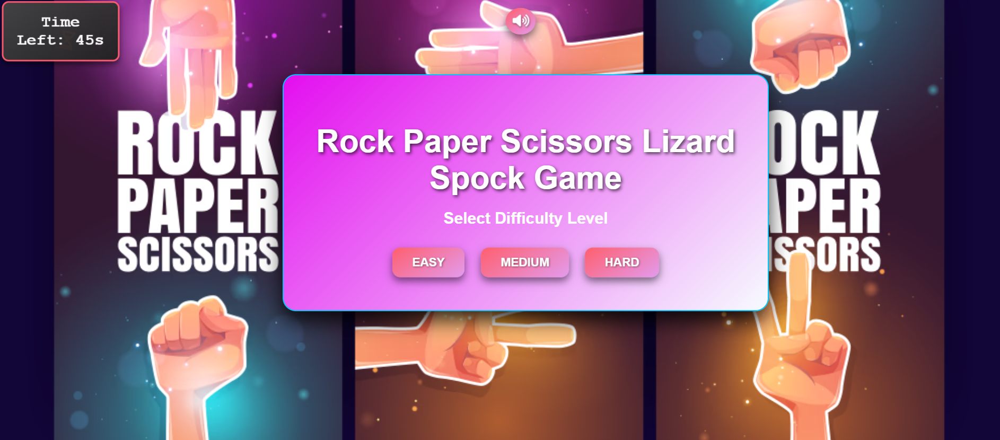
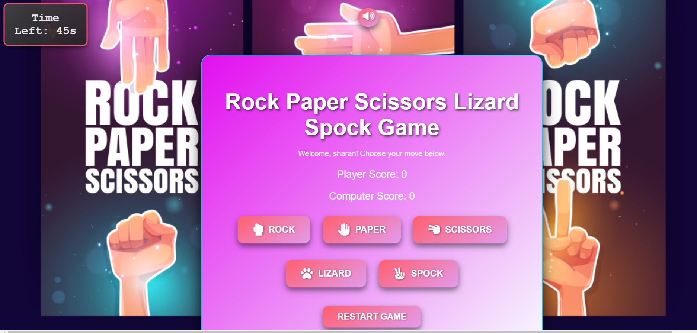
- Plays the click sound effect.
- Generates a random computer move.
- Compares moves to determine the round result and updates scores.
- Resets the timer for the next round.
- Checks if the game has ended and calls `endGame()` if necessary.

### 3. **Timer Management**

The `startTimer()` and `resetTimer()` functions:

- `startTimer()`: Initializes and starts the countdown for the round. timer begins when the player start his first move
- `resetTimer()`: Resets the countdown to the initial value and restarts it for the next round.45 sec

### 4. **Ending the Game**

The `endGame(message)` function:
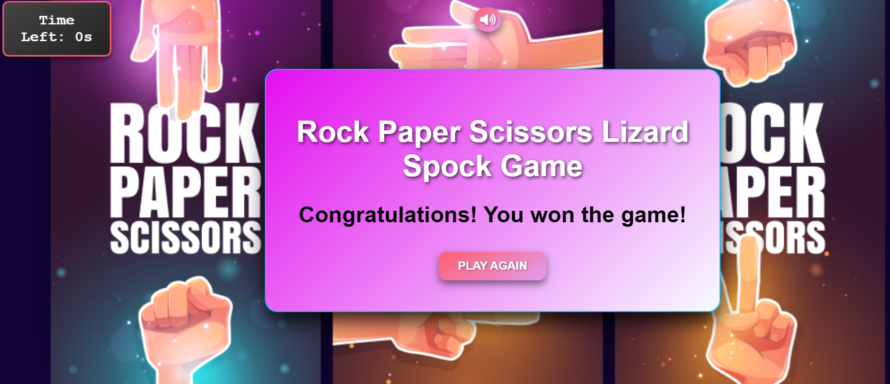
- Hides the game section and displays the game-over section with a result message.
- Provides an option to play again.

### 5. **Restarting the Game**

The `restartGame()` function:

- Resets scores and game state.
- Resets the timer.
- Shows the name input section and hides the game and game-over sections.

### 6. **Managing the Rules Modal**
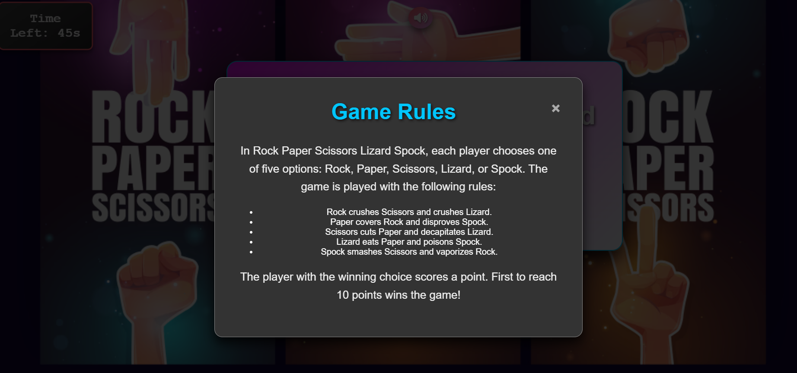

The `showRules()` and `hideRules()` functions:

- `showRules()`: Displays the modal with game rules.
- `hideRules()`: Hides the modal.
- An event listener closes the modal if a user clicks outside of it.

### 7. **Mute Button**

The `toggleMute()` function:

- Toggles the background music and sound effects on and off.
- Updates the mute button icon to reflect the current state.

## Meeting Game Criteria

### Pattern Matching Functionality

Pattern matching typically involves recognizing sequences or patterns in the input. In the context of Ultimate RPS, this could mean recognizing specific sequences of moves. If the game tracks or responds to sequences of player moves, it includes pattern matching. For example, if the game responds differently when a player plays "Rock, Paper, Scissors" in that order versus another order, that would be pattern matching.

### A Limited Number of Tries Before the Game is Over

Ultimate RPS has a built-in mechanism to limit the number of tries. The game is set to end when either the player or the computer reaches a score of 10, ensuring that the game has a clear endpoint and does not continue indefinitely.

### A Score Tracking System

The game includes a robust score tracking system. Scores for both the player and the computer are updated in real-time and displayed on the screen. The game continues to update these scores until one side reaches a score of 10.

### The Ability to Play Against the Computer

Ultimate RPS allows players to compete against a computer opponent. The computer makes random moves, and the outcome of each round is determined based on the player's move versus the computer's move, providing an engaging and unpredictable gaming experience.

## GitHub Deployment and Clone ##

GitHub Deployment

To deploy the project

The site was deployed to GitHub pages. The steps to deploy a site are as follows:

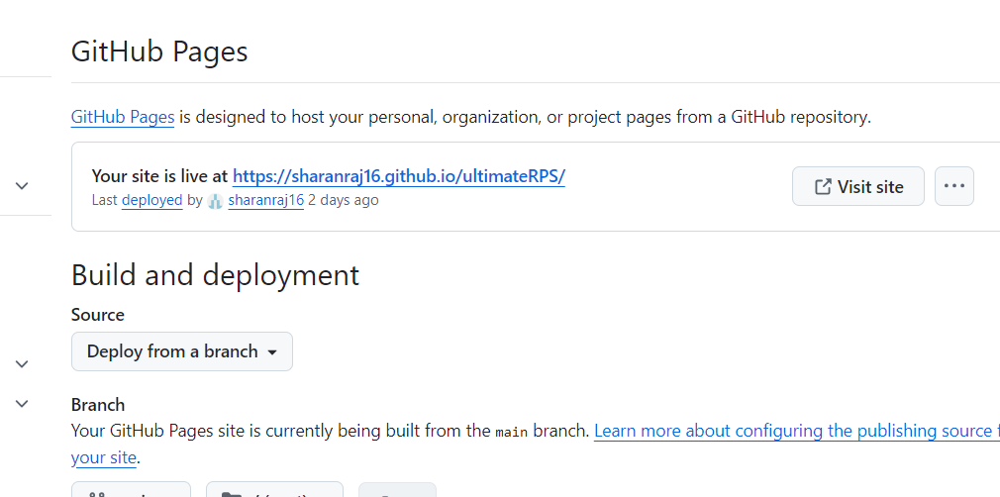

1.In the GitHub repository, navigate to the Settings tab.
2.Once in Settings, navigate to the Pages tab down the side menu.
3.Under Source, select the branch to master, then click save.
4.Once the master branch has been selected, the page will be automatically refreshed with a detailed ribbon display to indicate a successful deployment.

Access the Live Site: After a few minutes, your site will be live at https://<sharanraj16>.github.io/<ultimateRPS>/.

**Cloning the Repository**

To create a local clone of this project
The method from cloning a project from GitHub is below:

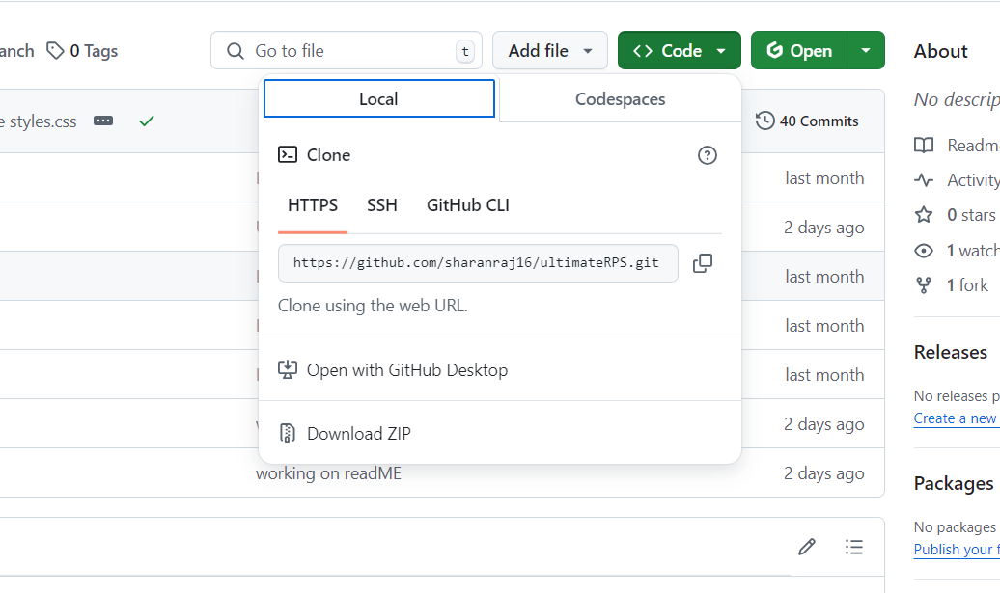

1.Under the repository’s name, click on the code tab.
2.In the Clone with HTTPS section, click on the clipboard icon to copy the given URL.
Cloning image
3.In your IDE of choice, open Git Bash.
4.Change the current working directory to the location where you want the cloned directory to be made.
5.Type git clone, and then paste the URL copied from GitHub.
6.Press enter and the local clone will be created.

## Performance and Device Compatibility

The

 game has been tested for performance and compatibility across various devices. The following table summarizes the results:

| Device Type       | Device Model           | Browser           | Compatibility Status | Notes                                    |
|-------------------|-------------------------|--------------------|-----------------------|------------------------------------------|
| **Desktop**       | Dell XPS 15             | Chrome 112         | Passed                | Responsive design and functionality tested successfully. |
| **Tablet**        | iPad Air (4th Gen)      | Safari 15          | Passed                | Touch interactions and layout tested.    |
| **Mobile**        | iPhone 14               | Safari 16          | Passed                | Mobile-friendly design and performance checked. |
| **Mobile**        | Samsung Galaxy S23      | Chrome 114         | Passed                | Responsive layout and functionality confirmed. |
| **Desktop**       | MacBook Pro 16          | Firefox 114        | Passed                | Smooth performance and UI responsiveness verified. |
| **Tablet**        | Microsoft Surface Pro 8 | Edge 114           | Passed                | Functional across various screen sizes.  |

## Lighthouse Test Results

The game has been tested using Chrome's Lighthouse tool. The following summarizes the key metrics from the Lighthouse performance audit:
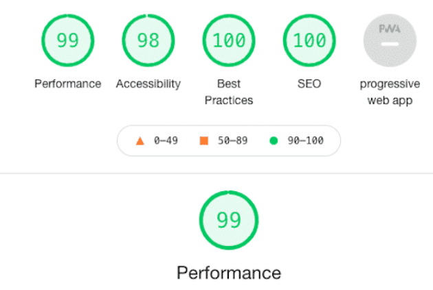
| Metric                        | Score  |
|-------------------------------|--------|
| **Performance**               | 99     |
| **Accessibility**             | 98     |
| **Best Practices**            | 100    |
| **SEO**                       | 100    |
| **PWA (Progressive Web App)** | 99     |

- **Performance**: Achieved a score of 99, indicating fast load times and efficient resource usage.
- **Accessibility**:  score of 98, demonstrating compliance with accessibility standards.
- **Best Practices**: Full score of 100, reflecting adherence to modern web best practices.
- **SEO**: Full score of 100, ensuring good search engine optimization.
- **PWA**:  score of 99, confirming that the application meets progressive web app standards.

The game's code has also been validated with the W3C validator and jshint.com, ensuring compliance with web standards.no errors found
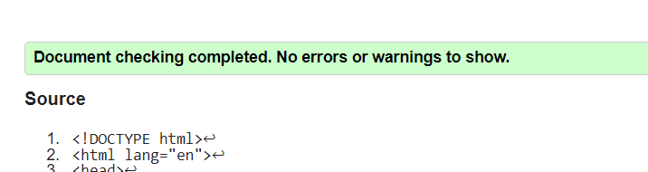
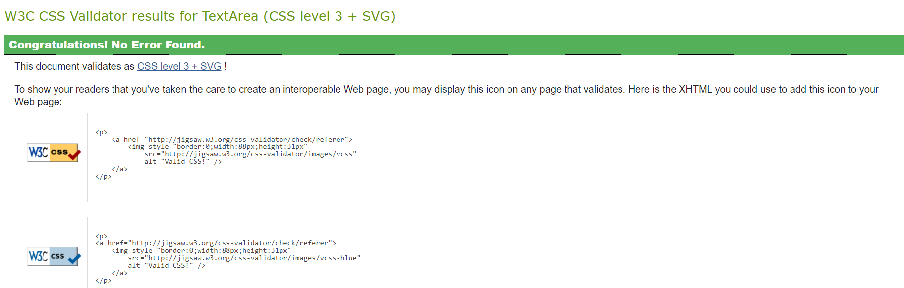
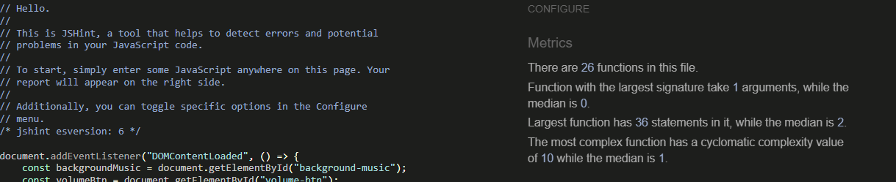
## Acknowledgments

Special thanks to:

- **[Error makes clever](https://www.youtube.com/@ErrorMakesClever)**: For insightful tutorials on web development technologies.
- **[Logic First Tamil](https://www.youtube.com/@LogicFirstTamil)**: For clear explanations of programming concepts and logical problem-solving approaches.
- **Code Institute**:Tutor Assistance and studenst support for providing a comprehensive Full Stack Developer course that enabled the development of this project. .. i have completed  BTEC HND in computing in 2012, but the study material and the LMS of code institute is the best. 

- **Slack Community**: For the continuous support and collaboration throughout the course, contributing to the successful completion of this project.
- **VHS library**: I would like to extend my sincere thanks to my library assistant at VHS Library Oberhausen, who helped me immensely by providing the JavaScript books I needed to complete this project. 

## Conclusion

Thank you for exploring the Ultimate RPS game project. This application showcases the integration of HTML, CSS, and JavaScript to create an interactive web-based game. It highlights my proficiency in web development and offers a fun experience for users. 

sharanraj sivakumar
---

